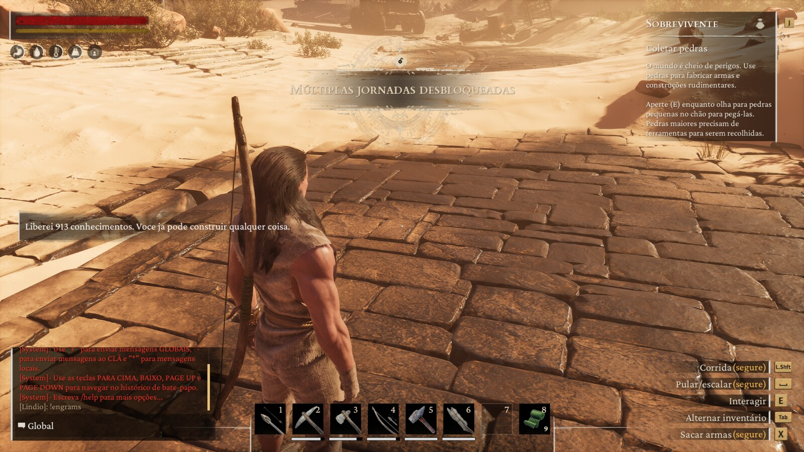
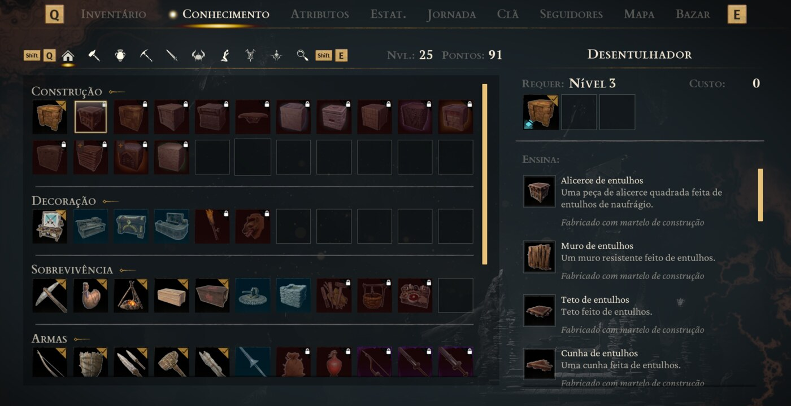
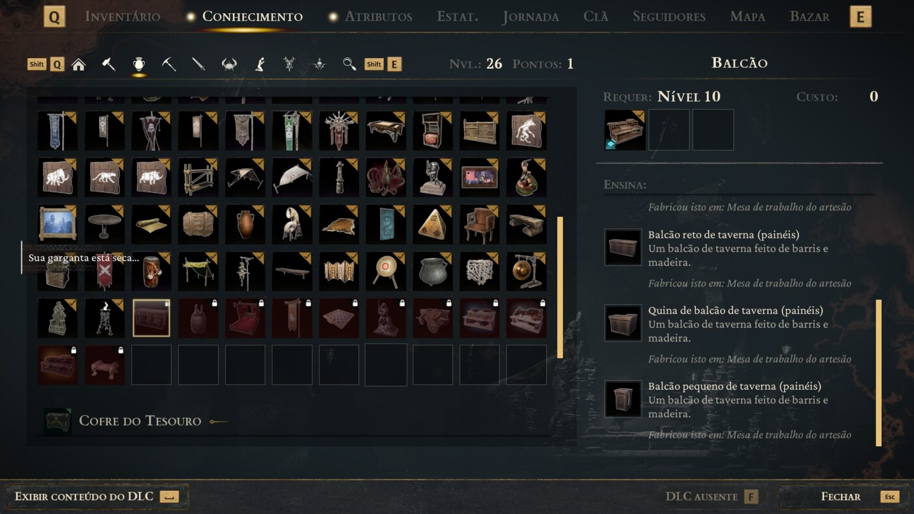

<div align="center">

# ⚒️ Unlock Engrams

### One chat command. The entire knowledge tree.

**`!engrams`** — and a solo player has every blueprint in the Exiled Lands.
No grind, no points, no level gate.

<br>

[](https://www.conanexiles.com/)
[](https://github.com/andrew-mauricio/Conan-Api)
[](#building-from-source)
[](LICENSE)

**Server-side only** · unmodified clients · no Workshop item · nothing to download

<br>



<sup>A real server, a real character. One command, **913 knowledges** granted and
every journey unlocked with them.</sup>

</div>

<br>

## Play solo without the grind

Conan's knowledge tree is paid for with points you earn one level at a time, and
a character who hasn't ground for them simply cannot build most of the game.
That is fine on a big PvP server, where the climb *is* the game.

It is not fine when you are three friends on a private server with a couple of
hours on a Tuesday, or one person who just wants to build the fortress they have
in their head.

**This plugin removes that wall for the people who chose to remove it.** Drop it
on your server, type one command, and the whole tree opens — every foundation,
every bench, every piece of furniture, every weapon and armour recipe.

<table>
<tr>
<td width="50%" valign="top" align="center">

**Before** — level 25, padlock on almost everything



</td>
<td width="50%" valign="top" align="center">

**After** — one command, the tree is open



</td>
</tr>
</table>

<sup>The client in these shots is set to Brazilian Portuguese and so is that
server's `config.json` — the text players read is **data**, not code. Translating
this plugin is editing one file. See [`config.json`](#configjson).</sup>

> **The padlocks that remain say "DLC missing", not "not enough points".**
> Those are Funcom's paid packs, and this plugin does not — and will not —
> hand them out. [Why, and how it was proved.](#why-some-feats-are-refused--and-why-that-is-correct)

<br>

## Install in three steps

```
1.  Copy the UnlockEngrams folder into
        <server>\ConanSandbox\Binaries\Win64\Conan-Api\Plugins\

2.  Restart the server.

3.  Look for this line in Conan-Api\Logs\ConanApi.log:
        [engrams] ready. Type !engrams in the game chat.
```

Nothing to enable, no other file to edit. The folder name has a **hyphen** —
`Conan-Api`, never run together.

Requires [Conan-Api](https://github.com/andrew-mauricio/Conan-Api) installed on
the server.

<br>

---

## What "engram" means here

Conan doesn't use the word. Players coming from ARK do, and they mean the same
thing: the knowledge that lets you build. In Conan it's split in two, and
unlocking only one half leaves the player stuck.

<table>
<tr>
<td width="50%" valign="top">

### 🌳 Feats

The knowledge tree — the part that costs points in game. Buying a feat is what
teaches the recipes attached to it.

</td>
<td width="50%" valign="top">

### 📜 Recipes

The individual craftable entries. A character carries a flag,
`UnlockAllRecipes`, that short-circuits the whole check.

</td>
</tr>
</table>

This plugin does **both**. Feats alone would leave out whatever the tree doesn't
cover; recipes alone would leave the feat window empty and confuse anyone who
opens it.

<br>

## The command

| in chat | what it does |
|---|---|
| **`!engrams`** | unlocks every feat and every recipe for whoever typed it |

> [!IMPORTANT]
> **The prefix is `!`, not `/`.** That isn't a style choice: Conan's client
> swallows `/command` locally and never sends it to the server, so no plugin in
> any API gets to see it. Measured on a live server — `/apitest` never reached
> the hook, while `!apitest` did.

The command is swallowed, so it never shows up in everyone's chat. The player
who typed it sees their own message echoed locally; that's Conan's client being
optimistic, and it's normal.

<br>

## `config.json`

Everything has a default that works. A server that never opens this file still
gets a working command.

```json
{
  "command":    "!engrams",
  "permission": "",

  "msg_ok":      "Unlocked {n} knowledges. You can build anything now. Another {dlc} belong to DLC your account doesn't own.",
  "msg_denied":  "You are not allowed to use this command.",
  "msg_partial": "Unlocked {n} knowledges, but not all of it. If something still won't build, tell an admin: the reason is in ConanApi.log.",
  "msg_failed":  "I could not unlock the knowledge. Tell an admin: the reason is in ConanApi.log."
}
```

| placeholder | becomes |
|---|---|
| `{n}` | how many knowledges this run actually granted, confirmed one by one |
| `{dlc}` | how many the game refused as DLC the account doesn't own |

Somebody who already had everything sees `{n}` as `0`, and that is correct.
Leave a placeholder out and the message is used exactly as written.

**This is also where you translate the plugin.** The text players read isn't in
the source at all — it's data, so a server whose players read another language
changes this file and never touches a line of code.

### Restricting it

`"permission"` is empty by default, so anybody can use it. That's the deliberate
default for a server that installed this on purpose: handing out the knowledge
is the point.

Name a [Permission](https://github.com/andrew-mauricio/Conan-Api-SDK) node and it
becomes restricted:

```json
"permission": "engrams.use"
```

> [!WARNING]
> **If Permission isn't installed and you've configured a node, nobody passes.**
> Opening the command to everyone because a dependency is missing would be the
> opposite of what you asked for by naming a node. The log says exactly that,
> rather than failing quietly in either direction.

<br>

---

## How it works

It hooks `ConanPlayerController::ServerSendChatMessage` — the RPC the client
sends when somebody types. The `Server` prefix is Unreal's convention for "runs
on the server at the client's request", which is where a command belongs.

From there it goes straight at the player's own progression component — **no
admin, no CheatManager**:

```cpp
ConanCharacter::GetProgressionSystem()             // the component
ProgressionSystem::ServerForceLearnFeat(id, ...)   // grant, FORCED
ProgressionSystem::IsFeatPurchased(id) -> bool     // the proof
```

**FORCED is the whole point.** `ServerPurchaseFeat` is the shop path and checks
what you'd expect — cost, level, prerequisites. `ServerForceLearnFeat` is how
the game itself grants a feat when a teacher NPC or a quest gives one: no points
spent, no level requirement, no prerequisite walk. The game does the work; this
plugin never writes over its data.

The recipes half is the character's own replicated flag: set the bit, call the
game's `OnRep_UnlockAllRecipes` so the reaction runs, then **read the bit back**.

> [!NOTE]
> **Not the cheat manager, on purpose.** The obvious route is
> `ConanCheatManager::LearnAllFeats()`. For a non-admin it dispatches perfectly
> and does nothing at all — so a plugin built on it tells the player everything
> is unlocked while the knowledge window still shows padlocks. Measured on a
> live server: `cheat manager=ConanCheatManager  admin=no`, both calls reported
> as executed, nothing learned.

### The list comes from the table, not from memory

`FeatItem` derives from `GameItem`, so walking `FindObjects("FeatItem", ...)`
looks right. It is wrong: **the game only instantiates a `FeatItem` for a feat
the character already knows.** That version scored `98 walked · 98 already had ·
0 refused` — a flawless result against the wrong population.

The canonical source is the `FeatTable` DataTable, where the **row names are the
template ids**. That is every feat in the build, whether anybody learned it or
not.

### Nothing counts unless the game confirms it

For every feat: ask `IsFeatPurchased`, force it, ask again. The numbers in the
log are counts of **confirmed state**, never of calls made.

```
[engrams] FeatTable: 2346 row(s) — this is every feat in the build.
[engrams] feats: 2346 walked · 913 learned now · 101 already had · 1332 refused
[engrams] recipes flag: now SET (OnRep=called).
```

### Three outcomes, never two

| result | the player is told | the log says |
|---|---|---|
| ✅ feats **and** recipes | `msg_ok` | `unlocked for <id> (N learned, M already had, recipes on)` |
| ⚠️ only one of the two | `msg_partial` | `PARTIAL for <id>: <why>` |
| ❌ neither | `msg_failed` | `FAILED for <id>: <why>` |

Half is a real outcome. Telling the player "done" would be a lie in one
direction and "failed" a lie in the other, and they'd find out which by walking
to a bench and not being able to build.

<br>

---

## Why some feats are refused — and why that is correct

The base `FeatTable` is not just the base game: it carries **every DLC's feats
too**, tagged in `FeatTableRow.DLCPackage`. The game refuses to grant one
belonging to a DLC the account doesn't own.

Proved with two accounts on one server, same code, same table:

| account | learned | already had | **refused** |
|---|---|---|---|
| A | 913 | 101 | **1332** |
| B | 871 | 346 | **1129** |

Identical 2346-row table, **different refusals**. A defect in this plugin would
have refused the same rows for both. The game's own knowledge window agrees: the
padlocks that remain read **"DLC missing"**, not "not enough points".

That is why `{dlc}` exists in the messages. It isn't an apology — it's the other
half of the truth. A player who owns Siptah gets the Siptah feats; one who
doesn't, doesn't.

> [!IMPORTANT]
> **This plugin will not bypass DLC entitlements.**
> `ConanCheatManager::SetBypassEntitlements` exists on this build and would step
> over that check. DLC is content Funcom sells. Handing it out for free is not a
> feature, and nobody should end up doing it by accident because they installed
> a plugin that unlocks building knowledge.

### And the knowledge window isn't the whole picture

`!engrams` also unlocks crafting knowledge that lives outside the building tree.
If you are counting padlocks in that one tab to decide whether it worked, you
will undercount — check a crafting bench too.

<br>

## What this does NOT do

Stated on purpose, because a known limit beats a surprise.

- **It doesn't undo.** There's no `!engrams off`. The game has `ForgetAllFeats`
  and this plugin deliberately doesn't expose it: one command that gives, with
  no command that takes away by accident.
- **It doesn't keep a list.** The unlock is written to the character the game's
  own way, so it survives a restart exactly as if an admin had done it by hand.
  But the plugin remembers nobody, and a wiped character starts over.
- **It doesn't touch other players.** Each `!engrams` affects only whoever typed
  it. There's no server-wide switch here.

<br>

---

## Building from source

You don't need this to use it — the folder ships with the DLL built.

<table>
<tr>
<td width="50%" valign="top">

**Windows** (what most people use)

Open *x64 Native Tools Command Prompt for VS* from the Start menu and run:

```bat
compilar.bat
```

It finds `cl.exe` or `g++` on its own. If the SDK lives elsewhere:

```bat
set CONAN_SDK_INCLUDE=C:\path\to\SDK\include
compilar.bat
```

</td>
<td width="50%" valign="top">

**Linux / WSL**

```bash
./compilar.sh
```

Needs the MinGW-w64 cross compiler. No Visual Studio, no Unreal editor, no
engine source.

</td>
</tr>
</table>

The build is **reproducible**: `--no-insert-timestamp` keeps the linker from
stamping the clock into the PE header, so the same source always produces the
same bytes. Build it yourself and compare the hash against the release — that
check is the point, and without this flag it would be theatre.

The DLL depends only on `KERNEL32.dll` and `msvcrt.dll`, and exports exactly two
symbols:

```
ConanPluginCarregar
ConanPluginDescarregar
```

Nothing of the API's runtime is compiled in: what crosses the boundary is a
plain-C struct of function pointers, which is why any compiler works and why an
MSVC-built plugin runs against a MinGW-built runtime.

<details>
<summary><b>Why some names are in Portuguese</b></summary>

<br>

Names like `ConanPluginCarregar`, `LerTextoDoJogo`, `OffsetDoMembro` and
`tamanho` are part of Conan-Api's **published ABI**. Renaming them would break
every plugin already compiled against it, so they stay.

Everything this repository owns — comments, documentation, log output, build
scripts, variable names — is English. The SDK ships a glossary in
`Docs/DEVELOPERS.md`.

</details>

<br>

## Trust model

This plugin runs **inside your server's process**, with the same powers the
server has: all of memory, player data, the disk, the network. There's no
sandbox — that's what "native plugin" means in any game, and pretending
otherwise would be worse than saying it plainly.

The source is here, it's one file, and it's MIT. Read it before you install it,
or build it yourself and compare the hash. That's the only real protection a
server owner has, and it's the one this project asks you to use.

<br>

## Licence

MIT — see [LICENSE](LICENSE). Copy it, change it, redistribute it, sell it.

Conan-Api's **runtime** carries its own, more restrictive licence. That
restriction belongs to the runtime and does not reach plugins written against
it; this plugin is MIT and nothing here limits what you do with it.

<br>

---

<div align="center">

**This is an independent, community-developed project.**
Not affiliated with, endorsed by, sponsored by, or supported by
Funcom or Inflexion Games.

*Conan Exiles* and all related marks are the property of Funcom.

</div>
